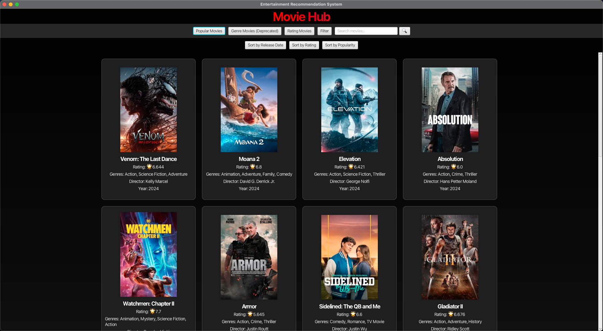
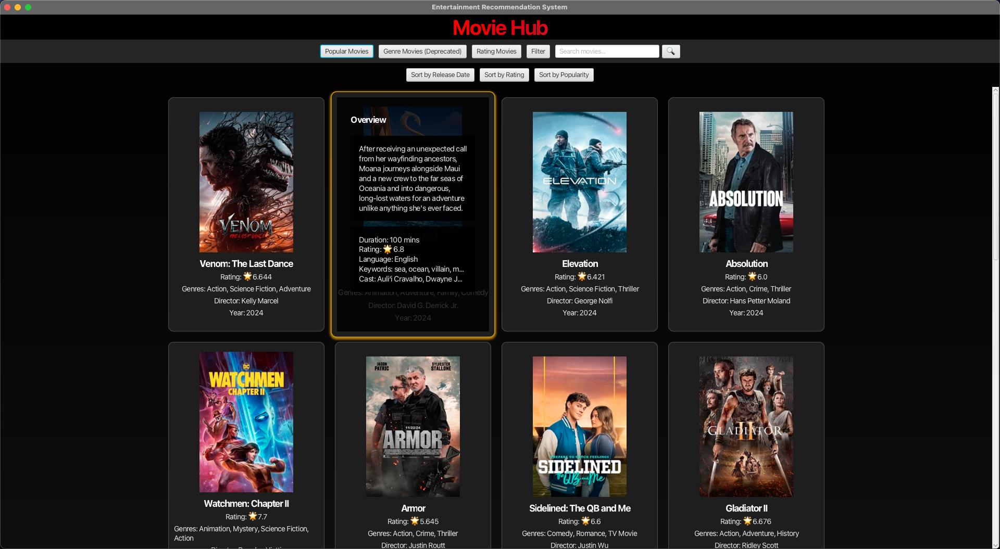
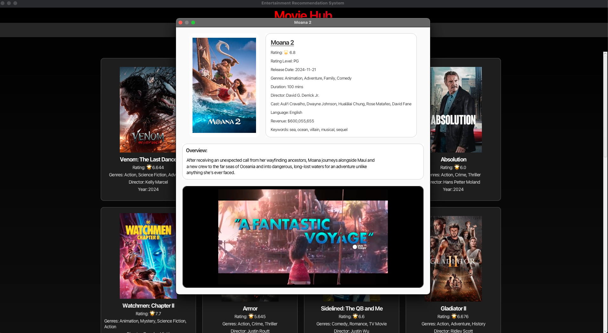
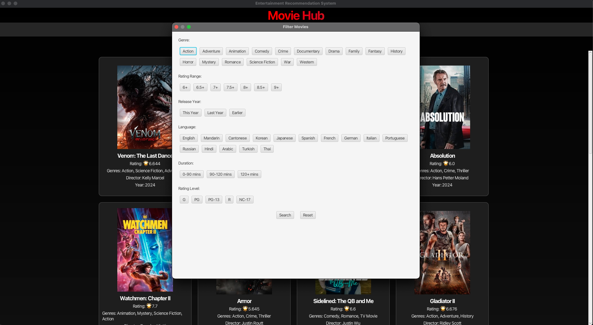

# Entertainment Recommendation System
***
## 📄 Basic Information
* **Author: Erdun E**
* **Course: CS5010 Program Design Paradigm**
* **Program: Final Project**
* **Professor: Lindsay Jamieson**
* **Version: 1.35**
* **Last Update: December 10, 2024**
---
## 🎬 Project Overview
The **Entertainment Recommendation System** is a **JavaFX-based** application that provides personalized movie recommendations by interacting with the **TMDB API**. This system allows users to explore movies based on different recommendation strategies, apply filters, and search for specific movies.  
The project evolved significantly from the mid-semester prototype to the final version, integrating more features and implementing robust design patterns to ensure flexibility and maintainability.




---
## 🧩 Design Patterns
* **Strategy Design Pattern**
  * Allows dynamic switching between different recommendation strategies.
  * Implemented strategies include:
    * Popular Recommendation
    * Genre-Based Recommendation( )
    * Rating-Based Recommendation
* **Factory Design Pattern**
  * Creates recommendation strategies dynamically based on user input.
* **Context Class**
    * Manages different strategies and allows switching strategies during runtime.
---
## 🚀 Key Features
### 🎥 **Dynamic Recommendation Strategies**
* **Popular Recommendations:**  
  Discover the most popular movies currently trending.

* **Genre-Based Recommendations:**  
  Get recommendations based on selected movie genres.

* **Rating-Based Recommendations:**  
  Find highly-rated movies, sorted by their ratings.


### 🔍 **Search Functionality**

* **Search Movies by Title:**  
  Allows users to search for specific movies by entering keywords.

### 🛠️ **Advanced Filtering Options**

Users can apply multiple filters to refine their recommendations:
* **Genre**: Action, Comedy, Drama, etc.
* **Rating Range**: Filter by user ratings (e.g., 7+, 8+).
* **Release Year**: This year, last year, or earlier.
* **Language**: English, Mandarin, Korean, etc.
* **Duration**: 0-90 mins, 90-120 mins, or 120+ mins.
* **Certification**: G, PG, PG-13, R, NC-17.

### 🖥️ **Interactive JavaFX GUI**

* **User-Friendly Interface:**  
  An intuitive interface for navigating through recommendations, searching, and filtering movies.

* **Hover Overlays:**  
  View detailed information by hovering over movie cards.

### 📋 **Detailed Movie Information**

Each movie card displays:
* Title
* Rating
* Genres
* Director
* Release Date
* Duration
* Language
* Keywords
* Cast
* Overview
* Trailer

### 🔄 **Sorting Options**

Users can sort movie recommendations by:
* **Release Date**
* **Rating**
* **Popularity (Revenue)**

### 📊 **Logging System**

* Provides detailed logs for system events, errors, and user interactions using a custom logging helper.
---
## 🛠️ Dependencies

* **Java SDK 23.0.1**: Core Java SDK for running the application.
* **[JavaFX SDK 23.0.1](https://gluonhq.com/products/javafx/)**: For building the graphical user interface.
* **[JSON Library (json-20240303.jar](https://mvnrepository.com/artifact/org.json/json/20240303)**: For parsing TMDB API responses.

Ensure these dependencies are correctly set up in your project environment.

---

## 🌐 API Integration

* **TMDB API**  
  The application fetches movie data using The Movie Database (TMDB) API. Ensure you have a valid API key from [TMDB](https://www.themoviedb.org/documentation/api).

---

## 📥 Installation and Setup

### Prerequisites

* **Java Development Kit (JDK) 23.0.1 or higher**
* **JavaFX SDK 23.0.1**
* **Internet Connection** for accessing the TMDB API  

### Steps to Run

1. **Clone the Repository**

   ```bash
   git clone https://github.com/ErdunE/NortheasternMiami.git
   cd NortheasternMiami/CS5010ProgrammingDesignParadigm/Final Project/FinalProject/src

2. **Set Up API Key**

    - Obtain an API key from [TMDB](https://www.themoviedb.org/documentation/api).
    - Update `TMDBHttpRequest.java` with your API key:

      ```java
      private static final String API_KEY = "API_KEY";
      ```

3. **Configure Dependencies**

    - Dependencies are in `/src/dependencies/`
    - Ensure `javafx-sdk-23.0.1` is set in your `PATH`.
    - Add `json-20240303.jar` to your project's library path.

4. **Compile the Code**

   ```bash
   javac --module-path /path/to/javafx-sdk-23.0.1/lib --add-modules javafx.controls,javafx.fxml -d out src/**/*.java

5. **Run the Application**

    ```bash
    java --module-path /path/to/javafx-sdk-23.0.1/lib --add-modules javafx.controls,javafx.fxml -cp out Main
    ```
## 🧪 Testing

### Key Test Cases

1. **`RecommendationContextTest`**
    - Tests dynamic switching of recommendation strategies.
    - Verifies behavior when no strategy is set or a null strategy is provided.

2. **`RecommendationFactoryTest`**
    - Checks the creation of different strategies (`PopularRecommendation`, `RatingBasedRecommendation`).
    - Ensures invalid or null inputs throw appropriate exceptions.

3. **`TMDBServiceTest`**
    - Ensures TMDB API calls return valid movie data.
    - Verifies methods like `fetchPopularMovies`, `fetchMoviesByGenre`, `fetchRatingMovies`, and `searchMovies`.

4. **`PopularRecommendationTest`**
    - Tests fetching popular movie recommendations.
    - Checks if the recommendations list is not null or empty.

5. **`RatingBasedRecommendationTest`**
    - Verifies fetching and sorting of high-rated movies.
    - Ensures the recommendations list is returned in descending order of rating.

6. **`RecommendationGridTest`**
    - Tests the loading and display of movie recommendations.
    - Verifies sorting functionality for release date, rating, and popularity.

---

## 📝 Future Improvements

- **Support for TV Shows and Music Recommendations**  
  Extend the system to recommend TV shows and music based on user preferences.

- **User Profiles**  
  Implement user accounts for personalized recommendations and saved preferences.

- **Advanced Filters**  
  Add more filtering options, such as actors, directors, and specific keywords.

- **Offline Mode**  
  Allow the system to function offline by caching data locally.

- **Improved Error Handling**  
  Enhance error handling to provide more user-friendly error messages for network issues and API failures.

---

## 🐞 Known Issues

- **API Rate Limits:**  
  The TMDB API has a rate limit, which may cause temporary unavailability if too many requests are made in a short period.

- **Network Dependency:**  
  The application requires a stable internet connection to fetch movie data. Lack of connectivity can result in failures.

- **Slow Loading Times:**  
  Fetching large datasets or high-resolution images may result in slow loading times, especially on slower networks.

---

## 📧 Contact

For questions, feedback, or contributions, please contact:

**Erdun E**  
Email: `erdunwork@gmail.com`  
GitHub: [Erdun E](https://github.com/ErdunE)

---

